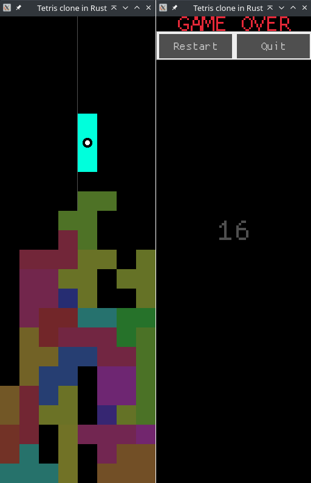

# Tetris clone in Rust

## Screenshot

## Intent

### Goals
+ Try game dev again after years of not doing that
	+ Includes exploring various, related Rust crates
+ Be recognizably Tetris-like
+ Procedurally generate something
	+ Minimum viable product: random colors
	+ Expanding: what if the pieces did not have to have four parts?
		+ Would that make the title "Tetra/Pent/Hex-is"?
	+ Current status: randomly chooses three to five parts, then randomly
	  builds each piece
+ Run smoothly
	+ Should not be difficult for a forty-year-old game

### Stretch goals
+ Add music
+ Speed up music exponentially with cleared rows
	+ *I.e.*, `speed *= 1.05` upon clearing each cleared row
	+ Probably needs MIDI
+ Dynamically re-write music based on game state
	+ *E.g.*, changing keys when changing pieces
	+ Probably easier with MIDI and simple, non-chromatic music
+ Run on platforms besides desktop Linux and WebAssembly
	+ Android?

### Non-goals
+ Make a commercially-viable product
+ Look good
+ Perfectly replicate any other Tetris implementations

## References

+ Rust game dev
	+ https://arewegameyet.rs/
+ 2D graphics library
	+ https://crates.io/crates/macroquad
